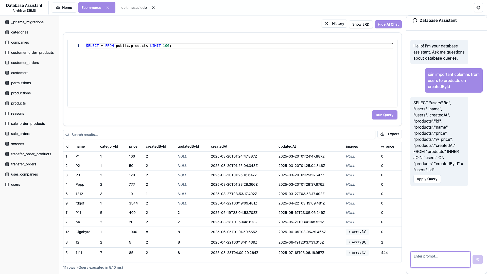

# 🗄️ AI Database Studio

> A powerful, AI-driven desktop application for database management and query assistance

[](https://electronjs.org/)
[](https://reactjs.org/)
[](https://typescriptlang.org/)
[](LICENSE)

**AI Database Studio** is a modern, cross-platform desktop application that simplifies database management through an intuitive interface powered by artificial intelligence. Built with Electron, React, and TypeScript, it provides developers and database administrators with powerful tools for connecting to, querying, and managing multiple database systems.



## ✨ Features

### 🔗 **Multi-Database Support**

- **PostgreSQL** - Full support with schema visualization
- **MongoDB** - Document database operations
- **MySQL** - Complete SQL operations
- **SQLite** - Local database management

### 🤖 **AI-Powered Assistance**

- Intelligent query suggestions and optimization
- Natural language to SQL conversion
- Automated query explanation and documentation
- Performance analysis and recommendations

### 📝 **Advanced Query Editor**

- Syntax highlighting with Monaco Editor
- Auto-completion for tables, columns, and SQL keywords
- Real-time error detection and validation
- Multi-tab query management
- Query execution history and bookmarks

### 📊 **Data Visualization & Management**

- Interactive data tables with sorting and filtering
- Entity Relationship Diagram (ERD) generation
- Export data in multiple formats (CSV, JSON, Excel)
- Schema visualization and exploration

### 🔒 **Security & Privacy**

- Encrypted credential storage
- Secure connection management
- Local data processing (no cloud dependencies)
- Connection-specific state isolation

### 🎨 **Modern User Experience**

- Dark/Light theme support
- Responsive and intuitive interface
- Cross-platform compatibility (Windows, macOS, Linux)
- Customizable workspace layouts

## 🚀 Quick Start

### Prerequisites

Before you begin, ensure you have the following installed:

- **Node.js** (v22 or higher)
- **pnpm** (recommended package manager)
- A supported database server

### Installation

1. **Clone the repository**

   ```bash
   git clone https://github.com/anmoldobariya/ai-db-studio.git
   cd ai-db-studio
   ```

2. **Install dependencies**

   ```bash
   pnpm install
   ```

3. **Start development server**
   ```bash
   pnpm dev
   ```

### Building for Production

```bash
# Build for your current platform
pnpm build

# Platform-specific builds
pnpm build:win    # Windows
pnpm build:mac    # macOS
pnpm build:linux  # Linux
```

## 🎯 Usage

### Creating Your First Connection

1. **Launch the application** and click "Add New Connection"
2. **Select your database type** (PostgreSQL, MongoDB, MySQL, or SQLite)
3. **Enter connection details**:
   - Host, port, username, and password for remote databases
   - File path for SQLite databases
4. **Test the connection** to ensure it works
5. **Save and connect** to start exploring your database

### Writing and Executing Queries

1. **Select a table** from the sidebar to auto-generate a basic SELECT query
2. **Edit the query** in the Monaco-powered editor with syntax highlighting
3. **Execute with Ctrl+Enter** or click the "Run Query" button
4. **View results** in the interactive data table below
5. **Export data** using the export button for further analysis

### Using AI Assistance

1. **Open the AI Chat** panel using the "Show AI Chat" button
2. **Describe what you want** in natural language
3. **Get AI-generated queries** and explanations
4. **Apply suggestions** directly to your query editor

## 🏗️ Architecture

The application follows a multi-process Electron architecture:

```
┌──────────────────┐    ┌─────────────────┐    ┌────────────────────┐
│   Main Process   │◄──►│ Preload Script  │◄──►│Renderer Process    │
│                  │    │                 │    │                    │
│ • DB Connections │    │ • Secure IPC    │    │ • React UI         │
│ • File System    │    │ • API Bridge    │    │ • User Interaction │
│ • AI Integration │    │ • Type Safety   │    │ • State Management │
└──────────────────┘    └─────────────────┘    └────────────────────┘
```

### Key Components

- **Main Process**: Handles database connections, file operations, and AI integration
- **Renderer Process**: React-based UI with TypeScript for type safety
- **Preload Script**: Secure bridge between main and renderer processes
- **Database Adapters**: Abstracted database clients for different DB types
- **AI Service**: Integration with AI models for query assistance

## 🛠️ Development

### Recommended IDE Setup

- **[VSCode](https://code.visualstudio.com/)** with the following extensions:
  - [ESLint](https://marketplace.visualstudio.com/items?itemName=dbaeumer.vscode-eslint)
  - [Prettier](https://marketplace.visualstudio.com/items?itemName=esbenp.prettier-vscode)
  - [TypeScript](https://marketplace.visualstudio.com/items?itemName=ms-vscode.vscode-typescript-next)
  - [Tailwind CSS IntelliSense](https://marketplace.visualstudio.com/items?itemName=bradlc.vscode-tailwindcss)

### Project Structure

```
ai-db-studio/
├── src/
│   ├── main/           # Main process (Node.js)
│   │   ├── ai/         # AI integration
│   │   ├── db/         # Database adapters
│   │   ├── ipc/        # IPC handlers
│   │   └── store/      # Secure storage
│   ├── preload/        # Preload scripts
│   └── renderer/       # Renderer process (React)
│       ├── components/ # UI components
│       ├── lib/        # Utilities
│       └── types/      # Type definitions
├── docs/              # Documentation
├── ROADMAP.md         # Development roadmap
└── README.md          # This file
```

### Available Scripts

```bash
# Development
pnpm dev              # Start development server
pnpm typecheck        # Run TypeScript checks
pnpm lint             # Run ESLint
pnpm format           # Format code with Prettier

# Building
pnpm build            # Build for production
pnpm build:unpack     # Build without packaging

# Platform-specific builds
pnpm build:win        # Build for Windows
pnpm build:mac        # Build for macOS
pnpm build:linux      # Build for Linux
```

## 🗺️ Roadmap

We have an exciting roadmap planned for the future! Check out our [detailed roadmap](ROADMAP.md) for upcoming features:

- **Phase 2**: Enhanced UX & Performance (Advanced history, auto-completion, data visualization)
- **Phase 3**: AI Integration & Intelligence (Natural language queries, smart optimization)
- **Phase 4**: Enterprise Features (Collaboration, extended DB support, cloud deployment)

## 🤝 Contributing

We welcome contributions! Here's how you can help:

1. **Fork the repository**
2. **Create a feature branch** (`git checkout -b feature/amazing-feature`)
3. **Make your changes** following our coding standards
4. **Add tests** for new functionality
5. **Commit your changes** (`git commit -m 'Add amazing feature'`)
6. **Push to the branch** (`git push origin feature/amazing-feature`)
7. **Open a Pull Request**

### Development Guidelines

- Follow TypeScript best practices
- Use conventional commit messages
- Add tests for new features
- Update documentation as needed
- Ensure cross-platform compatibility

## 📄 License

This project is licensed under the MIT License - see the [LICENSE](LICENSE) file for details.

## 🙋‍♂️ Support

If you encounter any issues or have questions:

- **Bug Reports**: [Open an issue](https://github.com/anmoldobariya/ai-db-studio/issues)
- **Feature Requests**: [Start a discussion](https://github.com/anmoldobariya/ai-db-studio/discussions)
- **Documentation**: Check our [docs folder](docs/)

## 🎉 Acknowledgments

- **[Electron](https://electronjs.org/)** for the cross-platform framework
- **[Monaco Editor](https://microsoft.github.io/monaco-editor/)** for the powerful code editor
- **[React](https://reactjs.org/)** and **[TypeScript](https://typescriptlang.org/)** for the robust frontend
- **[Tailwind CSS](https://tailwindcss.com/)** for beautiful styling
- **[Radix UI](https://radix-ui.com/)** for accessible components

---

<div align="center">
  <strong>Built with ❤️ for developers and database administrators</strong>
</div>
